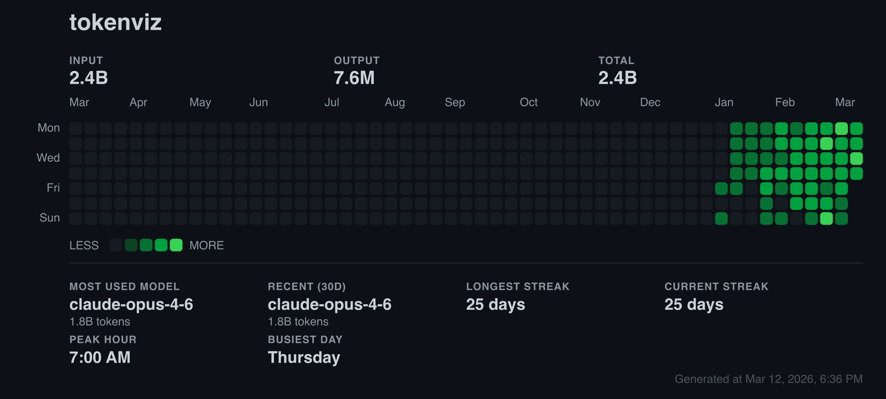
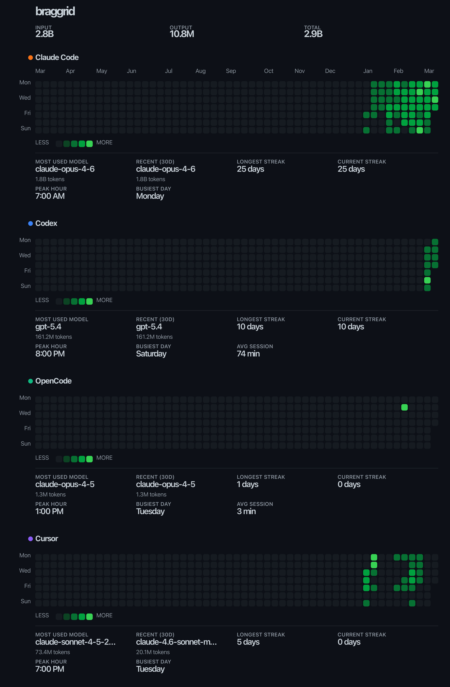

<div align="center">

# tokenviz

**Your AI coding stats, visualized.**

A GitHub-style contribution heatmap that shows how much you actually use AI coding tools.
One command. Auto-detected. Shareable.

[](https://www.npmjs.com/package/tokenviz)
[](https://github.com/harshkedia177/tokenviz/blob/main/LICENSE)

</div>

---

```
npx tokenviz@latest
```

That's it. It reads your local data, renders a heatmap in your terminal, and exports a shareable PNG.

<div align="center">

### Single Tool View



<br />

### Multi-Tool View



</div>

---

## Supported Tools

| Tool            | Data Source                      | What's Tracked                    |
| --------------- | -------------------------------- | --------------------------------- |
| **Claude Code** | `~/.claude/stats-cache.json`     | Tokens, models, sessions, costs   |
| **Codex CLI**   | `~/.codex/sessions/*.jsonl`      | Tokens, models, session durations |
| **OpenCode**    | `~/.local/share/opencode/`       | Tokens, models, messages          |
| **Cursor**      | Cursor API + local `state.vscdb` | Tokens, models, usage events      |

tokenviz auto-detects which tools you have installed. No configuration needed.

## Install

```bash
# Run directly (no install)
npx tokenviz@latest

# Run stats for a specific tool
npx tokenviz@latest --claude
npx tokenviz@latest --codex
npx tokenviz@latest --cursor
npx tokenviz@latest --opencode

# Or install globally
npm install -g tokenviz
tokenviz
```

Requires **Node.js 18+**.

## What You Get

### Terminal Heatmap

A full-color contribution grid right in your terminal, with:

- Token usage breakdown (input / output / total)
- Most used model (all-time + last 30 days)
- Current & longest streaks
- Peak coding hour & busiest day
- Average session length
- Per-tool usage panels

### Cost Analysis

See exactly how much your AI usage costs with `--cost`:

```
  💰 ESTIMATED COST

  MODEL                         INPUT         OUTPUT        CACHE READ    CACHE WRITE   TOTAL
  claude-opus-4-6               $0.37         $5.65         $33.9         $59.7         $99.5
  claude-sonnet-4-6             $0.03         $1.58         $4.06         $5.48         $11.2

  TOTAL                                                                                 $116
```

Breaks down cost per model with input, output, cache read, and cache write columns. Pricing is based on official published API rates.

### Shareable PNG/SVG

Automatically exports a high-quality image you can share on Twitter, LinkedIn, your blog, or anywhere.

```bash
tokenviz --user yourname              # PNG with your name
tokenviz --user yourname --export svg # SVG export
tokenviz --user yourname --copy       # PNG + copy to clipboard
```

## Usage

```bash
# Basic — auto-detect all tools, export PNG
tokenviz

# Add your name to the heatmap
tokenviz --user yourname

# Filter to a specific tool
tokenviz --claude
tokenviz --codex
tokenviz --cursor
tokenviz --opencode

# Filter to a specific year
tokenviz --year 2025

# Change the color theme
tokenviz --theme dark-green

# Export as SVG instead of PNG
tokenviz --export svg

# Custom output path
tokenviz --out ~/Desktop/my-ai-usage.png

# Terminal only, no file export
tokenviz --no-export

# Copy PNG to clipboard (macOS/Linux/Windows)
tokenviz --copy

# Dump raw stats as JSON (for scripting)
tokenviz --json

# Show estimated cost breakdown by model
tokenviz --cost
tokenviz --claude --cost
tokenviz --cost --no-export

# See all themes
tokenviz --list-themes
```

## Themes

10 built-in themes — 5 light, 5 dark:

| Dark          | Light             |
| ------------- | ----------------- |
| `dark-ember`  | `green` (default) |
| `dark-green`  | `purple`          |
| `dark-purple` | `blue`            |
| `dark-blue`   | `amber`           |
| `dark-mono`   | `mono`            |

```bash
tokenviz --theme dark-purple
tokenviz --theme amber
```

## Options

| Flag             | Description                            | Default        |
| ---------------- | -------------------------------------- | -------------- |
| `--user <name>`  | Username shown on the heatmap          | —              |
| `--claude`       | Include only Claude Code data          | —              |
| `--codex`        | Include only Codex data                | —              |
| `--opencode`     | Include only OpenCode data             | —              |
| `--cursor`       | Include only Cursor data               | —              |
| `--theme <name>` | Color theme                            | `green`        |
| `--export <fmt>` | Export format: `png` or `svg`          | `png`          |
| `--no-export`    | Skip file export, terminal only        | —              |
| `--out <path>`   | Custom output file path                | `tokenviz.png` |
| `--copy`         | Copy PNG to clipboard after export     | —              |
| `--year <year>`  | Filter to a specific year              | last 365 days  |
| `--json`         | Output raw stats as JSON               | —              |
| `--cost`         | Show estimated cost breakdown by model | —              |
| `--list-themes`  | Show all available themes              | —              |

## How It Works

tokenviz reads **locally stored data** from your AI coding tools. It never sends data anywhere — everything stays on your machine.

1. **Detect** — scans for installed tool data directories
2. **Aggregate** — merges token usage, sessions, and model stats across tools
3. **Render** — generates a terminal heatmap + exportable image
4. **Export** — saves a high-res PNG/SVG with stats panel

### Privacy

- All data is read **locally** from your filesystem
- Nothing is uploaded or transmitted
- The only network request is Cursor's API (to fetch your own usage CSV, using your local auth token) — and even that's optional with a local fallback

## FAQ

**Q: I don't see any data?**
Make sure you've actually used one of the supported tools. tokenviz reads from the default data locations — if you've customized paths, set the environment variable:

- `CLAUDE_CONFIG_DIR` for Claude Code
- `CODEX_HOME` for Codex CLI
- `OPENCODE_DATA_DIR` for OpenCode
- `CURSOR_STATE_DB_PATH` or `CURSOR_CONFIG_DIR` for Cursor

**Q: Can I use this in CI/scripts?**
Yes — `tokenviz --json` outputs machine-readable JSON.

**Q: The Cursor data seems low?**
If the API fetch fails (auth issues), tokenviz falls back to local line-count tracking which estimates tokens. The API-based data is more accurate.

## Contributing

PRs welcome! The codebase is TypeScript with ESM modules.

```bash
git clone https://github.com/harshkedia177/tokenviz.git
cd tokenviz
npm install
npm run dev    # watch mode
node dist/bin.js --list-themes
```

## License

MIT
